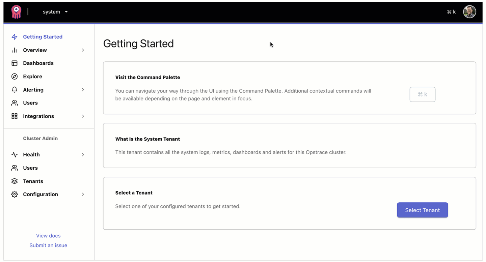

# Adding and Managing Users

## Introduction

An administrator can provision and manage users in Opstrace.
Users allow authentication against our web UI and the per-tenant Grafana UI.
An administrator can then* provide fine-grained permissions for what users can and cannot do.

\* _This is a roadmap item; all users are currently granted the ADMIN role_

## How to add a user

Adding a user is easy.

## How to remove a user

Removing a user can be done.
However, as you might expect, **this operation cannot be undone**.

