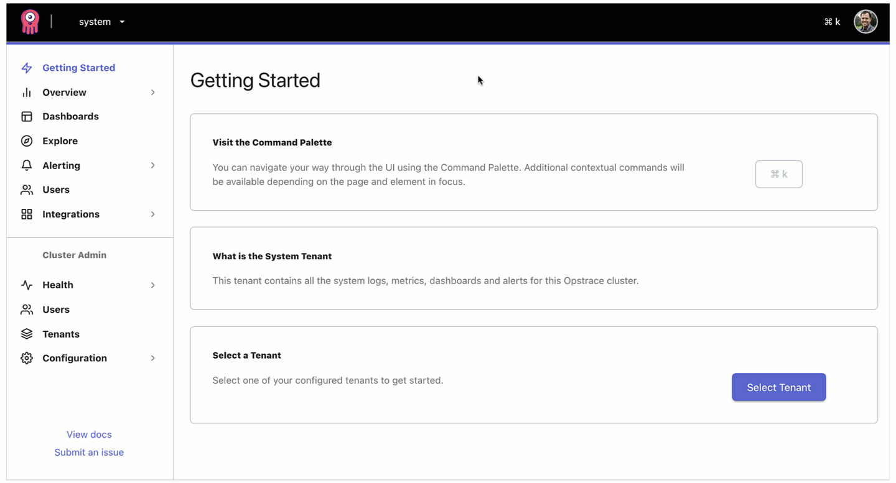

# Adding and Managing Users

## Introduction

An administrator can provision and manage "users" in Opstrace.
A "user" represents a human interacting with the Opstrace UI in an interactive session; the authentication proof is meant to be presented by a browser.
An administrator can then* provide fine-grained permissions for what users can and cannot do.

\* _This is a roadmap item; all users are currently granted the ADMIN role_

## How to add a user

Adding a user is easy.

## How to remove a user

Removing a user is easy.

