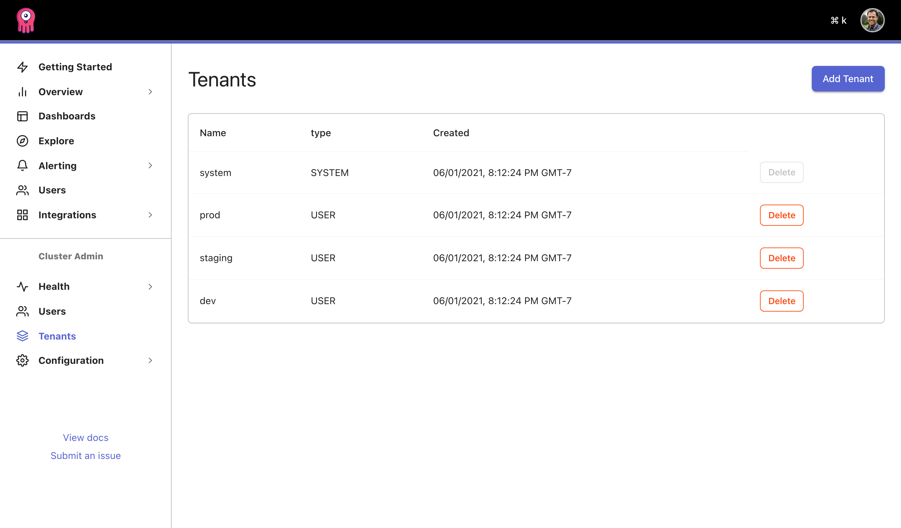

# Tenants Guide

This "tenant" guide will show you how to:

* Add tenants during the initial create operation
* Add new tenant to a running cluster (with public and private keys)
* Rate limit that new tenant
* Delete a tenant

## Introduction

A "tenant" is a unit of isolation.
[Multi-tenant systems](https://en.wikipedia.org/wiki/Multitenancy) allow for logical separation of concerns, while otherwise sharing the same underlying system.

Opstrace instances support multiple, secured tenants.
The tenant primitive extended from the underlying projects—Cortex and Loki.
Tenants isolate isolate data, dashboards, and API endpoints.
For example, isolate by:

* Teams (e.g., `team-revenue` vs. `team-fraud`)
* Environment (e.g., `prod`, `staging`, `dev`)
* A combination of these things, or anything else important to you.

Sometimes this isolation is used to address security concerns, but more generally, it helps keep things well-organized: because, after all, separation of concerns is a valuable best practice to keep in mind.



If you want a quick reference you can dip in and out of, see our [tenant reference](../../references/tenants.md) doc.

If you’re coming from the quick start, and haven’t yet sent data to one of your tenants, check out [integrations guide](../user/integrations.md).

## Create a Tenant Token with the CLI

Because Opstrace is secure by default we will first create a public/private keypair that will be used to authenticate clients that wish to access the tenant API.
If you have created your cluster with the `insecure` option you can skip to the [add a tenant with the UI](#user-content-create-a-new-tenant-in-the UI) section.

Let's walk through an example:  adding a new tenant named `newtenant` to a running Opstrace instance named `showdown`.

### 1) Create a new RSA Key Pair

Create a new RSA key pair and store it in a file with this command:

```text
./opstrace ta-create-keypair ./custom-keypair.pem
```

Note: The `ta-` prefix represents the idea of "tenant API authentication." All
`ta-*` commands offered by the Opstrace CLI are new and should be thought of as
experimental (command names and signatures are subject to potentially big
changes in the future).

After running this command, you have a local file `./custom-keypair.pem` in your
file system, with locked-down file permissions.
It is important to understand
that this file contains a secret, the _private_ key.

### 2) Create an Authentication Token

The following command creates a new authentication token, signed with the
private key of the key pair generated in the first step:

```text
./opstrace ta-create-token showdown newtenant custom-keypair.pem > token-showdown-newtenant.jwt
```

The token (emitted via `stdout` and captured in the file
`token-showdown-newtenant.jwt`) is a standards-compliant JSON Web Token (JWT),
implementing Opstrace-specific conventions:

* in the JWT header, it encodes an ID of the public key via which it can be
  cryptographically validated.
* in the JWT payload section, it encodes the name of the associated tenant.

For this token to become useful, an Opstrace instance needs to be configured
with the _public key_ corresponding to the private key that was used to sign the
token.
Let's do that.

### 3) Add the Public Key to a Running Opstrace Instance

You can think of this step as adding a new trust anchor to the trust store of a
running Opstrace instance.
Just like with X.509 certificates, trusting a public
key means that authentication proof signed with the correspond _private_ key is
accepted (reminder: in
[public-key cryptography](https://en.wikipedia.org/wiki/Public-key_cryptography),
verification of authentication proof only ever needs the non-sensitive public
key material and not the private key data—that's the beauty).

So, to make an existing Opstrace instance _trust_ the authentication token
generated in the previous step, we have to put the public key into the instance:

```text
./opstrace ta-pubkeys-add aws showdown custom-keypair.pem
```

## Create a New Tenant in the UI

### 4) Create a New Tenant with the UI

Visit `https://showdown.opstrace.io/cluster/tenants` and press the `Add Tenant` button.
Type the name of the new tenant (here: `newtenant`).


**Warning**: we do not yet do strict tenant name validation.
To make sure things
work, please keep the name lower case `[a-z]` for now.

The Opstrace controller running in the Opstrace instance will start a number of new components and initiate a DNS reconfiguration.

Effectively, we're now waiting for the DNS name
`cortex.newtenant.showdown.opstrace.io` to become available.

We can probe that from our point of view with `curl`:

```text
curl https://cortex.newtenant.showdown.opstrace.io/api/v1/labels
```

It should take about 5 minutes for DNS name resolution errors to disappear.
Next
up, expect an HTTP response with status code `401`, showing the error message
`Authorization header missing` in the response body.

## Test Tenant API Authentication

Let's add said header and make an example API call against the Cortex API for
the new tenant:

```text
$ curl -vH "Authorization: Bearer $(cat token-showdown-newtenant.jwt)" \
    https://cortex.newtenant.showdown.opstrace.io/api/v1/labels
...
< HTTP/2 200
...
{"status":"success","data":[]}
```

Getting a `200` response (and not a `401` response) means: the authentication
token provided in the request was accepted.
The so-called _authenticator_ in the
Opstrace instance extracted the public key ID from the token's header section,
found a corresponding public key in its trust store (think: "set of public keys
that I am configured to trust"), and then performed a cryptographic verification
using that public key.
It also confirmed that the tenant name encoded in the
token matches the tenant associated with the API endpoint.

You could now go ahead and take this authentication token and configure serious
API clients with it, such as a Prometheus instance to be able to `remote_write`
to `https://cortex.newtenant.showdown.opstrace.io/api/v1/push`.

## Send Data to a new Tenant with an Integration

Opstrace provides integrations that simplify collection of data from various.
This includes automating the configuration of the API tokens.
For example, from a Kubernetes cluster.

For more information, visit our forthcoming Integrations Guide.

## Delete a Tenant

Deleting a tenant is simple, and permanent.


