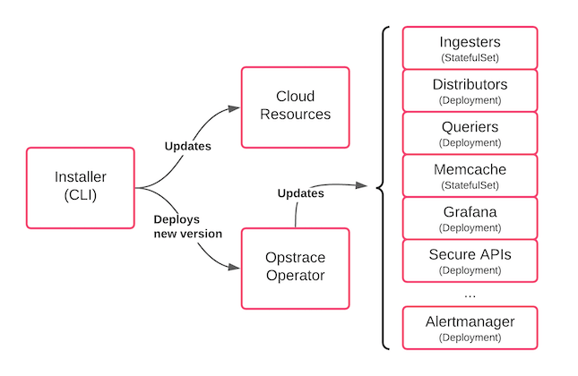

# Upgrading

This guide will show you how to upgrade Opstrace to the latest available version on AWS.

The upgrade command updates the cloud resources and deploys an updated version of the Opstrace operator, which in turn updates the components of the system:



**NOTES:**

There are many issues associated with doing upgrades well.
There are a few scenarios that are not yet fully supported, but we plan to continue working on them into the future.
If you'd like to contribute we'd love to have your help.

We do not **yet** support upgrades on GCP.

## Step 1: Check your setup

In the directory you originally installed Opstrace from, make note of the original Opstrace CLI version you have:

```bash
./opstrace --version
```

Make sure you have the config file you origally used for installation:

```bash
cat opstrace-config.yaml
```

## Step 2: Upgrade Opstrace

Download the latest Opstrace CLI binary from S3, which you will use to upgrade Opstrace (~50M compressed):

<!--tabs-->

### MacOS

```bash
curl -L https://go.opstrace.com/cli-latest-macos | tar xjf -
```

### Linux

```bash
curl -L https://go.opstrace.com/cli-latest-linux | tar xjf -
```

Make note of this new version:

```bash
./opstrace --version
```

Define `OPSTRACE_NAME` with your Opstrace installation name:

<!--export-to-input-->

```bash
export OPSTRACE_NAME=<name_choosen_at_install_time>
```

**Your input needed:** After you initiate the command below, a browser page may pop up asking you to sign in with your Google account.
(The URL will also be printed in the CLI output.)

Let's get things going:

```bash
./opstrace upgrade aws $OPSTRACE_NAME \
  -c opstrace-config.yaml
```

**Be patient:** Upgrade takes on average 10 minutes on AWS (but it can go as long as 30 minutes if upgrading Cortex and Loki).

**So you know:** The CLI is largely re-entrant for both `create` and `upgrade`. If it is interrupted for some reason, you can re-invoke the same command and it will continue where it left off.
For additional information understanding and troubleshooting the `upgrade` command, see our [CLI reference section](../../references/cli.md#upgrade).

When everything is done, you'll see the following log line:

`info: Opstrace cluster upgrade done for $OPSTRACE_NAME (aws)`

In case of any **upgrade errors** check the [known issues section](troubleshooting.md#known-issues) or search our [GitHub issues](https://github.com/opstrace/opstrace/issues).
