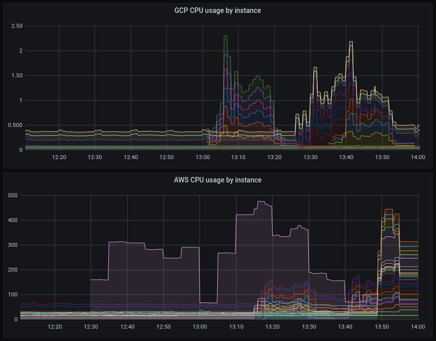
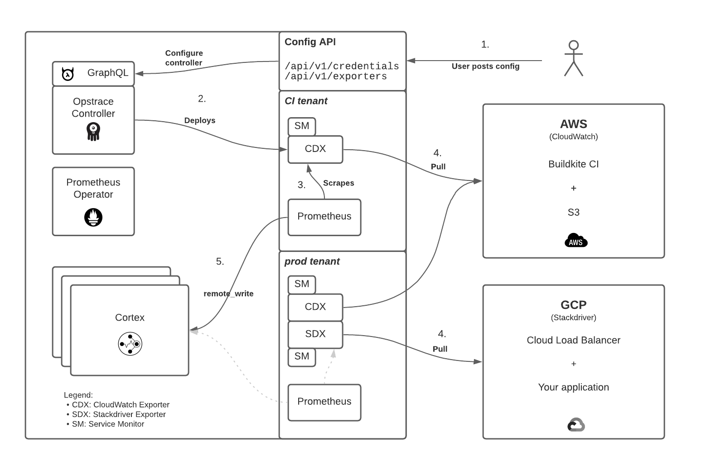

# Cloud Metrics

Prometheus supports a wide range of exporters for getting metrics out of other systems and into Prometheus.
This guide describes how to configure managed exporters for AWS CloudWatch, GCP Stackdriver, and Azure Monitor metrics within Opstrace.

This functionality allows you to collect metrics from your Cloud accounts into a single location.
For example you can keep track of S3 disk usage, GKS node size, and ELB throughput.
Some third party services like Buildkite also emit custom metrics that you can then collect.
As Cloud metrics are collected into Opstrace, they can then be used in e.g. [alerts](configuring-alerts.md) and Grafana dashboards:



In this guide we will show you how to set up working exporters for all three major cloud providers, AWS, GCP, and Azure.
In both cases, the process is identical: You provide Opstrace with credentials to access the cloud account, and then with a configuration listing the metrics you would like to collect.
The difference between the services is in the format of the credentials and metrics configuration.

To keep things easier to follow, we will provide separate sections for each service, but you can mix and match them as needed, running potentially several exporters of each type simultaneously in each tenant.

## How It Works

To set up a new Cloud exporter, we need two things:

* Cloud credentials for accessing the metrics. As best practice, these must be configured to only allow access to the metrics and nothing else. The scopes/roles to assign are described below.
* Configuration listing metrics to be retrieved. This can be as narrow or as broad as you like, but keep in mind that both AWS CloudWatch and GCP Stackdriver charge per metric retrieved, so this could get expensive.

As you provide Opstrace with the credentials and configuration, the following will occur:

1. The credentials and configuration are stored into an internal Postgres database
2. In the Opstrace Kubernetes cluster, the credentials are created as Secrets and the exporters as Deployments.
3. The deployed exporters use the credentials to fetch the configured list of metrics from the cloud services.
4. The exporters serve the metrics to Prometheus to be scraped and imported into the internal metrics database, available for dashboards and alerts.

This diagram shows an example deployment, where the `CI tenant` is running an AWS CloudWatch exporter while the `prod tenant` is running an AWS CloudWatch and GCP Stackdriver exporters. The metrics from these exporters are then written to the Opstrace Cortex instance against each tenant:



## AWS CloudWatch

These instructions show how you can extract metrics from [AWS CloudWatch](https://aws.amazon.com/cloudwatch/) and bring them into Opstrace.

### Credentials

First we will need to set up an AWS access key with sufficient permissions for accessing CloudWatch.
The exact process will vary depending on your local procedures around account credentials.
The underlying [cloudwatch_exporter documentation](https://github.com/prometheus/cloudwatch_exporter#user-content-credentials-and-permissions) recommends configuring an IAM policy with `cloudwatch:ListMetrics`, `cloudwatch:GetMetricStatistics`, and `tag:GetResources` permissions.
Once an IAM account has been configured with the necessary scoped access, you should generate a key pair for the account and save it to be submitted to Opstrace.

The generated key pair is submitted to Opstrace as follows.
In this example, we are creating a credential named `example-aws-credential` under a tenant named `dev`, using the corresponding `tenant-api-token-dev` for authentication:

```bash
$ echo '
name: example-aws-credential
type: aws-key
value:
  AWS_ACCESS_KEY_ID: <KEY ID HERE>
  AWS_SECRET_ACCESS_KEY: <KEY SECRET HERE>
' | curl -v -H "Authorization: Bearer $(cat tenant-api-token-dev)" --data-binary @- https://me.opstrace.io/api/v1/credentials/
```

`example-aws-credential` can now be referenced in your CloudWatch exporter configurations under the same Opstrace tenant.
Behind the scenes, the credentials will be stored to an internal Postgres database in plaintext form, and then passed to the deployed `cloudwatch_exporter` as a Kubernetes Secret.

### Exporter

In Prometheus terminology, an "exporter" is a process that fetches metrics from somewhere and makes them available in a form that Prometheus supports.
Opstrace uses a stock build of the [`cloudwatch_exporter`](https://github.com/prometheus/cloudwatch_exporter) package to support exporting AWS metrics into Opstrace.

The CloudWatch exporter configuration is effectively a pass-through of the underlying settings exposed by the [`cloudwatch_exporter` configuration](https://github.com/prometheus/cloudwatch_exporter#user-content-configuration), and should work the same way as documented there.
In other words, anything you can do with a stock `cloudwatch_exporter` can also be done via the Opstrace exporter configuration.

The main thing to determine is what metrics should be collected.
These are then listed in the main `metrics` section of the configuration.
CloudMatch metrics are grouped into "namespaces" according to the service they are associated with.
In this example we will look at [CloudWatch metrics](https://docs.aws.amazon.com/cli/latest/reference/cloudwatch/list-metrics.html) under the `AWS/EC2` namespace, and custom Buildkite metrics under a `Buildkite` namespace.
Some common metrics are listed in the [AWS documentation](https://docs.aws.amazon.com/AWSEC2/latest/UserGuide/viewing_metrics_with_cloudwatch.html), or a listing of available metrics for your AWS account can be retrieved using the [Console](https://docs.aws.amazon.com/AWSEC2/latest/UserGuide/viewing_metrics_with_cloudwatch.html#list-ec2-metrics-console) or [CLI](https://docs.aws.amazon.com/AWSEC2/latest/UserGuide/viewing_metrics_with_cloudwatch.html#list-ec2-metrics-cli).
Keep in mind that fetching metrics is billed by AWS on a [per-metric basis](https://aws.amazon.com/cloudwatch/pricing/) so overly broad metric filters will come with a cost.

```bash
$ echo '
name: example-aws-exporter
type: cloudwatch
credential: example-aws-credential
config:
  region: us-west-2
  metrics:
  - aws_namespace: AWS/EC2
    aws_metric_name: CPUUtilization
    aws_dimensions: [InstanceId]
    aws_statistics: [Sum]
  - aws_namespace: Buildkite
    aws_metric_name: ScheduledJobsCount
    aws_dimensions: [Org, Queue]
    aws_statistics: [Sum]
  - aws_namespace: Buildkite
    aws_metric_name: RunningJobsCount
    aws_dimensions: [Org, Queue]
    aws_statistics: [Sum]
  - aws_namespace: Buildkite
    aws_metric_name: WaitingJobsCount
    aws_dimensions: [Org, Queue]
    aws_statistics: [Sum]
' | curl -v -H "Authorization: Bearer $(cat tenant-api-token-dev)" --data-binary @- https://me.opstrace.io/api/v1/exporters/
```

After the configuration has been submitted, a new `cloudwatch_exporter` container will be deployed against the Opstrace tenant.
The deployed exporter will collect the requested metrics using the configured credentials.
Each exporter configuration maps to its own separate deployment.
You can configure several exporters in the same Opstrace tenant, for example to collect from separate AWS accounts.

## GCP Stackdriver

These instructions show how you can extract metrics from [Stackdriver](https://cloud.google.com/monitoring/docs) and bring them into Opstrace.
Note that "Stackdriver" is currently being rebranded as "Operations Suite", but we use "Stackdriver" here since as of this writing everyone still calls it that anyway.

### Credentials

First we will need to set up a GCP service account with sufficient permissions for accessing Stackdriver.
The exact process will vary depending on your local procedures around account credentials.
The underlying [`stackdriver_exporter` documentation](https://github.com/prometheus-community/stackdriver_exporter#user-content-credentials-and-permissions) recommends configuring the service account with `roles/monitoring.viewer` access, or you can create a more granular custom role with `monitoring.metricDescriptors.list` and `monitoring.timeSeries.list` access.
Once the service account has been configured with the necessary scoped access, you should generate a key pair for the service account and save the resulting JSON to be submitted to Opstrace.

The generated JSON key pair is submitted to Opstrace as follows.
In this example, we are creating a credential named `example-gcp-credential` under a tenant named `dev`, using the corresponding `tenant-api-token-dev` for authentication.
We are reading the JSON credentials from a file named `my-gcp-credentials.json`:

```bash
$ echo "
name: example-gcp-credential
type: gcp-service-account
value: |-
$(cat my-gcp-credentials.json | sed 's/^/  /')
" | curl -v -H "Authorization: Bearer $(cat tenant-api-token-dev)" --data-binary @- https://me.opstrace.io/api/v1/credentials/
```

`example-gcp-credential` can now be referenced in your Stackdriver exporter configurations under the same Opstrace tenant.
Behind the scenes, the credentials will be stored to an internal Postgres database in plaintext form, and then passed to the deployed `stackdriver_exporter` as a Kubernetes Secret.

### Exporter

In Prometheus terminology, an "exporter" is a process that fetches metrics from somewhere and makes them available in a form that Prometheus supports.
Opstrace uses a stock build of the [`stackdriver_exporter`](https://github.com/prometheus-community/stackdriver_exporter) package to support exporting GCP metrics into Opstrace.

The Stackdriver exporter configuration is effectively a pass-through of the underlying settings exposed by the [`stackdriver_exporter` flags](https://github.com/prometheus-community/stackdriver_exporter#user-content-flags), and should work the same way as documented there.
In other words, anything you can do with a stock `stackdriver_exporter` can also be done via the Opstrace exporter configuration.

The main thing to determine is what metrics should be collected.
These are configured via the required `monitoring.metrics-type-prefixes` setting.
As implied by the name of the setting, this is a prefix match against the available metrics.
For example, specifying [`compute.googleapis.com/instance/cpu`](https://cloud.google.com/monitoring/api/metrics_gcp#gcp-compute) will include all instance CPU metrics under that path.
In this example we will look at [GCP metrics](https://cloud.google.com/monitoring/api/metrics_gcp) under `compute.googleapis.com/`.
For a current list of available metrics divided by service and category, see the [metrics list documentation](https://cloud.google.com/monitoring/api/metrics).
Keep in mind that fetching metrics is billed by GCP on a [per-MiB basis](https://cloud.google.com/stackdriver/pricing) so overly broad metric filters will come with a cost.

```bash
$ echo '
name: example-gcp-exporter
type: stackdriver
credential: example-gcp-credential
config:
  monitoring.metrics-type-prefixes: # required
  - compute.googleapis.com/instance/cpu
  - compute.googleapis.com/instance/disk
  - compute.googleapis.com/instance/network
  google.project-id: # optional
  - sample-project-id
  monitoring.metrics-interval: '5m' # optional
  monitoring.metrics-offset: '0s' # optional
' | curl -v -H "Authorization: Bearer $(cat tenant-api-token-dev)" --data-binary @- https://me.opstrace.io/api/v1/exporters/
```

After the configuration has been submitted, a new `stackdriver_exporter` container will be deployed against the Opstrace tenant.
The deployed exporter will collect the requested metrics using the configured credentials.
Each exporter configuration maps to its own separate deployment.
You can configure several exporters in the same Opstrace tenant, for example to collect from separate GCP projects or accounts.

## Azure Monitor

These instructions show how you can extract metrics from [Azure Monitor](https://docs.microsoft.com/en-us/azure/azure-monitor/) and bring them into Opstrace.

### Credentials

First we will need to set up an Azure AD Application registration, configure it with a role for accessing Azure Monitor, then generate a Client Secret, as described in [this guide](https://docs.microsoft.com/en-us/azure/active-directory/develop/howto-create-service-principal-portal).
The exact process may vary depending on your local procedures around account credentials.
The underlying [`azure_metrics_exporter` documentation](https://github.com/RobustPerception/azure_metrics_exporter#azure-account-requirements) recommends assigning the `Monitoring Reader` Role to the AD Application.
Note that in the dialog for adding the role assignment, you MUST start typing the AD Application's name before anything will appear.

The Azure Subscription UUID, Azure Tenant UUID, AD Application UUID, and generated Client Secret are submitted to Opstrace as follows.
In this example, we are creating a credential named `example-azure-credential` under a tenant named `dev`, using the corresponding `tenant-api-token-dev` for authentication:

```bash
$ echo "
name: example-azure-credential
type: azure-service-principal
value:
  AZURE_SUBSCRIPTION_ID: azure_subscription_uuid
  AZURE_TENANT_ID: azure_tenant_uuid
  AZURE_CLIENT_ID: azure_application_uuid
  AZURE_CLIENT_SECRET: application_client_secret
" | curl -v -H "Authorization: Bearer $(cat tenant-api-token-dev)" --data-binary @- https://me.opstrace.io/api/v1/credentials/
```

`example-azure-credential` can now be referenced in your Azure exporter configurations under the same Opstrace tenant.
Behind the scenes, the credentials will be stored to an internal Postgres database in plaintext form, and then passed to the deployed `azure_metrics_exporter` as a Kubernetes Secret.

### Exporter

In Prometheus terminology, an "exporter" is a process that fetches metrics from somewhere and makes them available in a form that Prometheus supports.
Opstrace uses a modified build of the [RobustPerception `azure_metrics_exporter`](https://github.com/RobustPerception/azure_metrics_exporter) package to support exporting Azure metrics into Opstrace.
The only modification is to support providing Azure credentials via environment variables rather than the metrics yaml configuration itself, as seen in [this PR](https://github.com/RobustPerception/azure_metrics_exporter/pull/101) to the project.

The Azure exporter configuration is effectively a pass-through of the underlying settings exposed by the [`azure_metrics_exporter` configuration](https://github.com/RobustPerception/azure_metrics_exporter#example-azure-metrics-exporter-config), and should work the same way as documented there.
In other words, anything you can do with a stock `azure_metrics_exporter` can also be done via the Opstrace exporter configuration.

The main thing to determine is what metrics should be collected.
These are configured via sections named `targets`, `resource_groups`, and/or `resource_tags`.
In the below example we are collecting Storage Account metrics against a `resource_group` named `my_group`.
For a current list of available metrics divided by resource type, see the [metrics list documentation](https://docs.microsoft.com/en-us/azure/azure-monitor/essentials/metrics-supported).
Keep in mind that fetching Azure Monitor metrics is billed by Azure on a [per-MiB and/or per-query basis](https://azure.microsoft.com/en-us/pricing/details/monitor/) so overly broad metric filters will come with a cost.

```bash
$ echo '
name: example-azure-exporter
type: azure
credential: example-azure-credential
config:
  resource_groups:
  - resource_group: my_group
    resource_types:
    - "Microsoft.Storage/storageAccounts"
    metrics:
    - name: Availability
    - name: Egress
    - name: Ingress
    - name: SuccessE2ELatency
    - name: SuccessServerLatency
    - name: Transactions
    - name: UsedCapacity
' | curl -v -H "Authorization: Bearer $(cat tenant-api-token-dev)" --data-binary @- https://me.opstrace.io/api/v1/exporters/
```

After the configuration has been submitted, a new `azure_metrics_exporter` container will be deployed against the Opstrace tenant.
The deployed exporter will collect the requested metrics using the configured credentials.
Each exporter configuration maps to its own separate deployment.
You can configure several exporters in the same Opstrace tenant, for example to collect from separate Azure projects or accounts.

## HTTP API Reference

The above examples show usage of the `POST` endpoints for submitting new configurations, but you can also list, view, update, and delete configurations.
All requests are scoped to an Opstrace tenant and must include an Authentication header containing a bearer token for that tenant.

### Credentials

Credentials are written to the internal Opstrace Kubernetes cluster against the tenant namespace.
Credentials may be referenced by one or more exporters under the same Opstrace tenant.
Updating a credential will automatically restart exporters using that credential.
Each credential within a tenant has a unique name.

#### List all credentials

Returns credential information for all credentials configured for the tenant.
Each entry includes credential metadata, while the credential content is not included.

```bash
curl -v -H "Authorization: Bearer $(cat tenant-api-token-dev)" https://me.opstrace.io/api/v1/credentials
```

#### Get credential details

Returns credential information for a single named credential.
The credential content is not included.

```bash
curl -v -H "Authorization: Bearer $(cat tenant-api-token-dev)" https://me.opstrace.io/api/v1/credentials/foo
```

#### Insert/Update credential(s)

Configures one or more credentials at a time.
If a credential already exists then this will update that credential, otherwise it will be inserted.
Any exporters referencing the credential will be restarted automatically to receive the change.

Credential updates may not change the type of the credential, instead it must be deleted and recreated with the new type, so that any exporters referencing the credential are also recreated.

```bash
echo '
name: foo
type: aws-key
value:
  AWS_ACCESS_KEY_ID: foo
  AWS_SECRET_ACCESS_KEY: bar
---
name: bar
type: gcp-service-account
value: |-
  {"service-account-json": "goes-here"}
---
name: baz
type: azure-service-principal
value:
  AZURE_SUBSCRIPTION_ID: azure_subscription_uuid
  AZURE_TENANT_ID: azure_tenant_uuid
  AZURE_CLIENT_ID: azure_application_uuid
  AZURE_CLIENT_SECRET: application_client_secret
' | curl -v -H "Authorization: Bearer $(cat tenant-api-token-dev)" --data-binary @- http://me.opstrace.io/api/v1/credentials/
```

#### Delete credential

Deletes the credential, making it no longer available to exporters.
Deletion will fail if the credential is currently in use by one or more exporters.

```bash
curl -v -H "Authorization: Bearer $(cat tenant-api-token-dev)" -XDELETE https://me.opstrace.io/api/v1/credentials/foo
```

### Exporters

Exporters are deployed in the internal Opstrace Kubernetes cluster against the tenant namespace.
Exporters may optionally reference one Credential under the same Opstrace tenant.
Updating an exporter’s configuration or a referenced credential will automatically restart the exporter.
Each exporter within a tenant has a unique name.

#### List all exporters

Returns a JSON list of exporter information for all exporters configured for the tenant.
Each entry in the response includes the full exporter configuration.

```bash
curl -v -H "Authorization: Bearer $(cat tenant-api-token-dev)" https://me.opstrace.io/api/v1/exporters
```

#### Get exporter details

Returns the exporter configuration for a single named exporter.

```bash
curl -v -H "Authorization: Bearer $(cat tenant-api-token-dev)" https://me.opstrace.io/api/v1/exporters/foo
```

#### Insert/Update exporter(s)

Configures one or more exporters at a time.
If an exporter already exists then this will update that exporter, otherwise it will be inserted.
The query will fail if the referenced credential names do not exist or if the referenced credential’s type is incompatible with the exporter.

```bash
echo '
name: foo
type: cloudwatch
credential: foo
config:
  region: us-west-2
  metrics:
  - aws_namespace: Buildkite
    aws_metric_name: ScheduledJobsCount
    aws_dimensions: [Org, Queue]
    aws_statistics: [Sum]
---
name: bar
type: stackdriver
credential: bar
config:
  monitoring.metrics-type-prefixes:
  - compute.googleapis.com/instance/cpu
---
name: baz
type: azure
credential: baz
config:
  resource_groups:
  - resource_group: my_group
    resource_types:
    - "Microsoft.Storage/storageAccounts"
    metrics:
    - name: Availability
    - name: Egress
    - name: Ingress
' | curl -v -H "Authorization: Bearer $(cat tenant-api-token-dev)" --data-binary @- http://me.opstrace.io/api/v1/exporters/
```

#### Delete exporter

Deletes the exporter, tearing it down and ending the export of the configured metrics.
Metrics that have already been exported into Opstrace are not deleted.
Any credential referenced in the exporter configuration is not deleted.

```bash
curl -v -H "Authorization: Bearer $(cat tenant-api-token-dev)" -XDELETE https://me.opstrace.io/api/v1/exporters/foo
```
