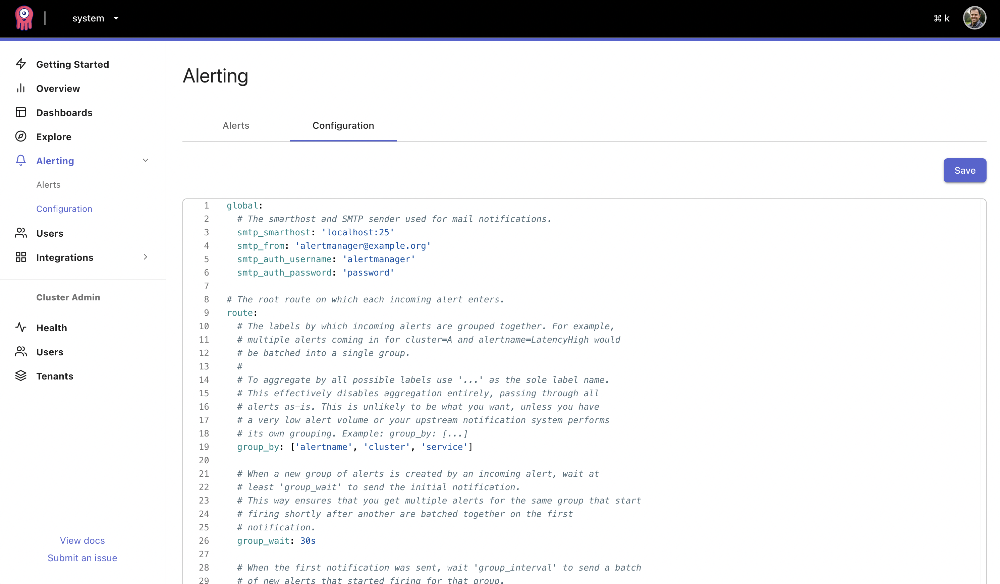
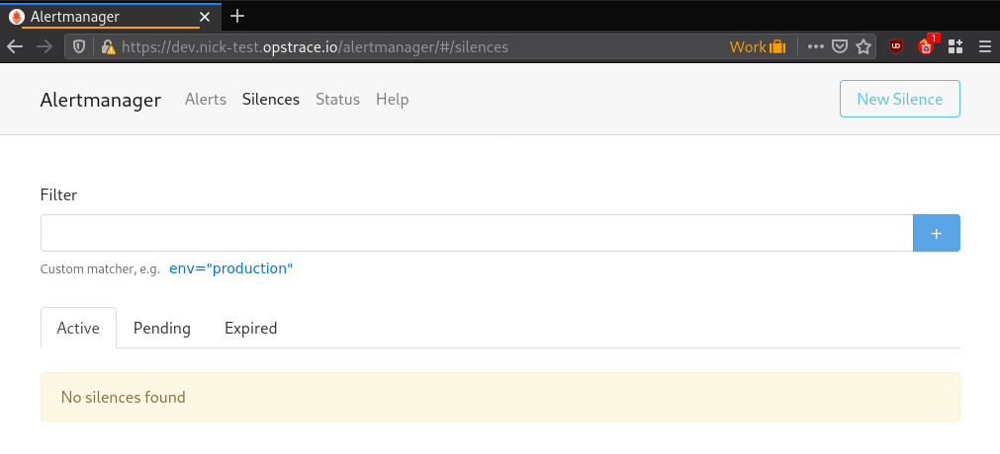
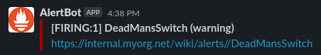

# Configuring Scalable Alertmanager

Opstrace supports configuring Alertmanager rules and alert outputs on a per-tenant basis.
For example, you might have an alerting rule that metric `X` must be less than 5 and an Alertmanager configuration to send a Slack message when the rule is failing.

If you haven't used Prometheus Alertmanager before, we recommend checking out [https://prometheus.io](https://prometheus.io/docs/introduction/overview/).
Opstrace uses Cortex which adds support for scaling and multiple tenants on top of Prometheus.

This user guide primarily covers the locations and formats for submitting configurations.
To learn more about the configuration content itself, look at the Prometheus documentation for [Recording Rules](https://prometheus.io/docs/prometheus/latest/configuration/recording_rules/), [Alerting Rules](https://prometheus.io/docs/prometheus/latest/configuration/alerting_rules/), and [Alertmanager](https://www.prometheus.io/docs/alerting/latest/alertmanager/) documentation.

## Using the UI to configure Alertmanager

You can configure the Alertmanager for each tenant from within the web interface.
To do this, in the sidebar, click "Alertmanager" under the tenant you're wanting to configure.
You'll then be presented with the configuration page:



Here you can paste your existing configuration yaml you use with Prometheus or start creating your own.
If you have previously used the CLI to manually upload your Alertmanager Configuration it'll now be available here to continue editing.
This form validates the YAML as you type, using the [Alertmanager Configuration specification](https://www.prometheus.io/docs/alerting/latest/configuration/) and won't let you publish something invalid.

### Limitations

At this stage there is no validation failure feedback given apart from disabling the "publish" button if the YAML content isn't valid.
There are a few xor validations not supported at present, such as in the HTTP and SMTP sections, so it is possible your config could be rejected by Cortex, when this happens that error message will appear under the "publish" button.

The UI and HTTP API can configure Alertmanager, but only the HTTP API can currently configure recording and alerting rules.

## Using the HTTP API to configure Alerts

You can also configure alerts over an HTTP API.
The API is internally a proxy of the following API routes provided by Cortex:

* [`/api/v1/rules/*`](https://cortexmetrics.io/docs/api/#list-rule-groups) for rules configuration
* [`/api/v1/alerts/*`](https://cortexmetrics.io/docs/api/#get-alertmanager-configuration) for Alertmanager configuration

All endpoints under the above-listed paths should be reachable as described in the Cortex documentation.
When querying these endpoints in Opstrace, provide the associated tenant auth token must.
(The [token identifies the tenant](https://opstrace.com/docs/references/concepts#data-api) used to store configuration).

### Basic alerts

Submit the Alertmanager configuration for the `dev` tenant with an HTTP `POST /api/v1/alerts` request.
The request should be paired with the `dev` tenant token.
The Alertmanager configuration itself is under an `alertmanager_config` field.

```bash
$ echo '
alertmanager_config: |
  route:
    receiver: 'default-receiver'
    group_wait: 30s
    group_interval: 5m
    repeat_interval: 4h
    group_by: [cluster, alertname]
  receivers:
    - name: default-receiver
' | curl -H "Authorization: Bearer $(cat tenant-api-token-dev)" --data-binary @- https://me.opstrace.io/api/v1/alerts
```

After you have submitted the configuration, it can be retrieved via  `GET /api/v1/alerts` with the same tenant token:

```bash
$ curl -H "Authorization: Bearer $(cat tenant-api-token-dev)" https://me.opstrace.io/api/v1/alerts
template_files: {}
alertmanager_config: |
  route:
    receiver: default-receiver
    group_wait: 30s
    group_interval: 5m
    repeat_interval: 4h
    group_by: [cluster, alertname]
  receivers:
    - name: default-receiver
```

At this point, you can also view the Alertmanager UI for the tenant by going to `https://dev.me.opstrace.io/alertmanager` in your browser, logging in to Opstrace if needed.
If the UI returns "the Alertmanager is not configured", it means you need to set the Alertmanager config for that tenant, either via `POST /api/v1/alerts` or via the Opstrace UI as described above.

Now that the Alertmanager is running, we can configure a test rule.
Send an HTTP `POST` request to `/api/v1/rules/myns` with the `dev` tenant token, to create a `mygroup` rule group under the `myns` namespace:

```bash
$ echo '
name: mygroup
rules:
- alert: DeadMansSwitch
  annotations:
    description: 'Testing that alerting pipeline is functional'
    summary: 'Alerting DeadMansSwitch'
  expr: vector(1)
  labels:
    severity: warning
' | curl -H "Authorization: Bearer $(cat tenant-api-token-dev)" --data-binary @- https://me.opstrace.io/api/v1/rules/myns
```

All configured rules for the tenant can be retrieved using `GET /api/v1/rules` with the `dev` tenant token:

```bash
$ curl -H "Authorization: Bearer $(cat tenant-api-token-dev)" https://me.opstrace.io/api/v1/rules
myns:
- name: mygroup
  rules:
  - alert: DeadMansSwitch
    expr: vector(1)
    labels:
      severity: warning
    annotations:
      description: Testing that alerting pipeline is functional
      summary: Alerting DeadMansSwitch
```

Refreshing the Alertmanager UI page at `https://dev.me.opstrace.io/alertmanager` should reveal a test alert within a minute or two.
The alert may pop in and out of the UI across refreshes as it repeatedly fires.



### Slack Alerts and Templates

Now that you can see alerts firing in the Alertmanager UI, you can update the Alertmanager configuration to send templated alerts to Slack.
Cortex allows submitting any templates under a separate `template_files` field in the Alertmanager configuration.
For example, update the Alertmanager configuration as follows, replacing `<slack_webhook_url>` with a Slack webhook URL, and `#test-alerts` with the desired channel:

```bash
$ echo '
alertmanager_config: |
  global:
    slack_api_url: "<slack_webhook_url>"
  route:
    receiver: slack-notifications
    group_by: [alertname, datacenter, app]
  receivers:
  - name: slack-notifications
    slack_configs:
    - channel: "#test-alerts"
      text: "{{ template \"slack.myorg.text\" .
}}"
  templates:
  - myorg.tmpl
template_files:
  myorg.tmpl: "{{ define \"slack.myorg.text\" }}https://internal.myorg.net/wiki/alerts/{{ .GroupLabels.app }}/{{ .GroupLabels.alertname }}{{ end }}"
' | curl -H "Authorization: Bearer $(cat tenant-api-token-dev)" --data-binary @- https://me.opstrace.io/api/v1/alerts
```

A templated test alert should appear in Slack after a minute or two:



From this point, you should have the basic building blocks for configuring your own alert rules and outputs.

### References

* [Prometheus Alertmanager](https://www.prometheus.io/docs/alerting/latest/alertmanager/)
* [Cortex Scalable Alertmanager](https://cortexmetrics.io/docs/proposals/scalable-alertmanager/)
* [Alertmanager Configuration](https://www.prometheus.io/docs/alerting/latest/configuration/)
* [Recording rules](https://prometheus.io/docs/prometheus/latest/configuration/recording_rules/)
* [Alerting rules](https://prometheus.io/docs/prometheus/latest/configuration/alerting_rules/)
