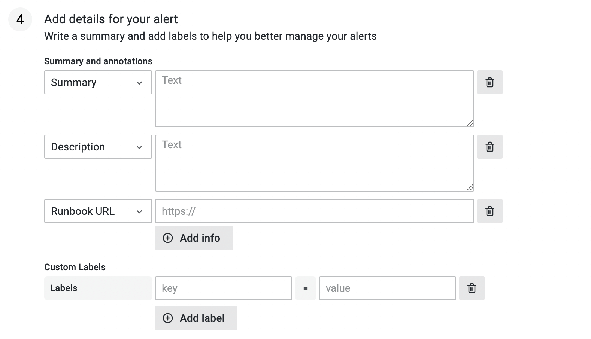

# Configuring Alertmanager

Opstrace supports configuring Alertmanager rules, notifications and silences on a [per-tenant](../../references/concepts.md#tenants) basis.
These can be visualized and edited with the new unified alerting UI in [Grafana 8](https://grafana.com/blog/2021/06/14/the-new-unified-alerting-system-for-grafana-everything-you-need-to-know/).

The ability to configure additional datasources for alerts (beyond Grafana itself) is a major change in Grafana 8 that allows you to configure alerts from another provider—such as Cortex and Loki—through the Grafana UI for alerts.
(The original Grafana alerts—now called "legacy alerts"—is still the default.)
Opstrace comes configured with Cortex and Loki as Grafana alert datasources.
This guide will focus on the UI because it is the most visual and self-explanatory, however the APIs are still available for anyone who would like to post changes directly there.

❓ If you do not yet have an Opstrace instance, pause here and create one by following our [Quick Start](../../quickstart.md).
It will take you about half an hour to spin one up in your own cloud account.

To configure a useful alert you need 3 pieces:  an *alert rule* to define the condition that triggers the alert, a *contact point* that defines the mechanism of alerting, and a notification policy that routes firing alerts to the appropriate *contact point*.

To get started from the Opstrace UI, first select the tenant where you would like to set the alert and then click *Alerting* in the sidebar:


## Configure an Alerting Rule

[Alerting rules](https://prometheus.io/docs/prometheus/latest/configuration/alerting_rules/) allow you to define alert conditions using the [Prometheus expression language](https://prometheus.io/docs/prometheus/latest/querying/basics/).
Whenever the expression evaluates as true, a notification will be generated and processed according to the policies and contact points (which we discuss below).

To configure a rule, the UI will lead you through the following steps:

### Step 1: Describe the Alert

Describe information about the alert, such as the name and type.
Select *Cortex/Loki* as the type (instead of Grafana) and then select the *metrics* datasource.
You can choose the namespace and group to organize your alerts, for example to group .


### Step 2: Create a Query

Create a query to be alerted on.  This query should include a condition that, when true, will trigger the alert.

```text
api_success_rate{pod="myapp-1"} < 0.95
```

### Step 3: Define Alert Conditions

The expression from step #2 has to be true for this long for the alert to be fired.


### Step 4: Add Details for your Alert

Add useful information to your alert, so when it comes in you can more quickly understand its meaning.
For example, provide a summary and description of the alert so anybody can understand what the alert means.
If you have it, a link to the runbook can make it faster to triage.



Next, you will need to configure a *contact type* to define a specific mechanism for delivering the notification.

## Configure a Contact Point

*Contact points* define where to send notifications about alerts that match a particular notification policy.
A contact point can contain one or more *contact point types*, e.g. email, Slack, webhook and so on.
A notification will dispatched to all contact point types defined on a contact point.

To configure a contact point for the Opstrace external Alertmanager, first select it from the drop down:


Next, enter a name and then choose a contact point *type*:

* Email
* OpsGenie
* PagerDuty
* Pushover
* Slack
* VictorOps
* Webhook

Each type provides customizable fields.
These allow you to choose the information that will be most helpful in the event of an alert.
For example, with PagerDuty:


To use your contact point, you must attach it to a *notification policy*.

### Example: Configuring Slack

Alerts in Slack are a convenient way to monitor the state of your Opstrace instance.
First, you need to create a Slack App and configure an *incoming webhook.*
Just follow their [4-step process document](https://api.slack.com/messaging/webhooks).
You can then enter it into the configuration for a Slack contact type:


## Configure a Notification Policy

*Notification policies* determine how alerts are routed to contact points.


Policies have a tree structure, where each policy can have one or more child policies. Each policy except for the root policy can also match specific alert labels. Each alert enters policy tree at the root and then traverses each child policy. If *continue matching subsequent sibling nodes* is not checked, it stops at the first matching node, otherwise, it continues matching it's siblings as well. If an alert does not match any children of a policy, the alert is handled based on the configuration settings of this policy and notified to the contact point configured on this policy. An alert that does not match any *specific policy* is handled by the *root policy*.

### How Label Matching Works

A policy will match an alert if the alert's labels match **all** of the *matching labels* specified on the policy.

* The *label* field is the name of the label to match. It must exactly match the label name.
* The *value* field matches against the corresponding value for the specified Label name. How it matches depends on the *regex* and *equal* checkboxes.
* The *regex* checkbox specifies if the inputted value should be matched against labels as a regular expression. The regular expression is always anchored. If not selected it is an exact string match.
* The *equal* checkbox specifies if the match should include alert instances that match or do not match.

### Example Setup

#### Set up the Root Policy

1. First, create a basic contact point for your alerts (e.g., Slack).
2. Edit the root policy and set it to have the contact point you just created.
3. Edit the root policy grouping to group alerts by cluster, namespace and alertname so you get a notification per alert rule and specific Kubernetes cluster & namespace.

#### Set up Specific Policies

* Create a specific route for alerts with "critical" severity with a different contact point type, like PagerDuty.
* Create specific route for alerts coming from a development cluster with an appropriate contact point.
* Create specific routes for particular teams that handle their own onduty rotations.


## Silencing an Alert

Silences suppress the delivery of a notification for a defined period of time.
They do not suppress the evaluation of an alert rule.

Silences are useful for disabling notifications during periods when notifications are expected, for example, during a deploy or during an incident investigation.

To create a silence, under the *Silences* tab...

1. First, select `alertmanager` from the *Choose alert manager*" drop-down.
2. Click the *New Silence* button.
3. Select the start and end date in *Silence start and end* to indicate when the silence should go into effect and expire.
4. Optionally, update the *Duration* to alter the time for the end of silence in the previous step to correspond to the start plus the duration.
5. Enter one or more matching labels by filling out the *Name* and *Value* fields. Matchers determine which rules the silence will apply to.
6. Optionally enter a comment.
7. Optionally edit the name of the owner in *Creator*.
8. Click *Create*.


You can inspect your created silences on the same tab:


Note:  Silences cannot be deleted manually; expired silences are automatically deleted after 5 days.

## References

* [Grafana 8 Alerts](https://github.com/grafana/grafana/tree/main/docs/sources/alerting/unified-alerting)
* [Prometheus Alertmanager](https://www.prometheus.io/docs/alerting/latest/alertmanager)
* [Cortex Scalable Alertmanager](https://cortexmetrics.io/docs/proposals/scalable-alertmanager)
* [Alertmanager Configuration](https://www.prometheus.io/docs/alerting/latest/configuration)
* [Recording rules](https://prometheus.io/docs/prometheus/latest/configuration/recording_rules)
* [Alerting rules](https://prometheus.io/docs/prometheus/latest/configuration/alerting_rules)
