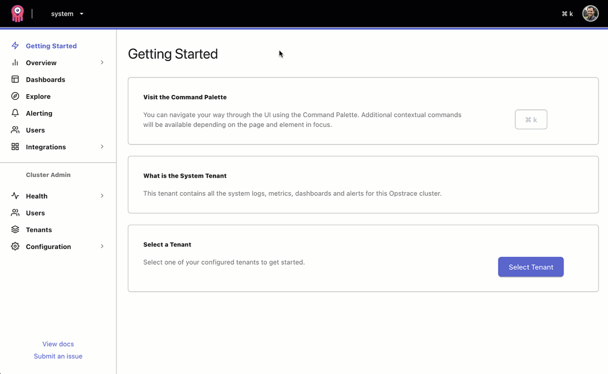

# Configuring Alertmanager

Opstrace supports configuring Alertmanager rules, notifications and silences on a [per-tenant](../../references/concepts.md#tenants) basis.
These can be visualized and edited with the new unified alerting UI in [Grafana 8](https://grafana.com/blog/2021/06/14/the-new-unified-alerting-system-for-grafana-everything-you-need-to-know/).

The ability to configure additional data sources for alerts (beyond Grafana itself) is a major change in Grafana 8 that provides alert configuration for another provider—such as Cortex and Loki—through the Grafana UI for alerts.
(The original Grafana alerts—now called "legacy alerts"—is still the default.)
Opstrace comes configured with Cortex and Loki as Grafana alert data sources.
This guide primarily focuses on the UI because it is the most visual and self-explanatory, however  [APIs are available](#using-the-http-api-to-configure-alerts) for anyone who would like to post changes directly there.

❓ *If you do not yet have an Opstrace instance, pause here and create one by following our [Quick Start](../../quickstart.md).
It will take you about half an hour to spin one up in your own cloud account.*

To configure a useful alert you need three pieces:

1. an *[alert rule](#configure-an-alerting-rule)* to define the condition that triggers the alert,
2. a *[contact point](#configure-a-contact-point)* that defines the mechanism of alerting,
3. and a *[notification policy](#configure-a-notification-policy)* that routes firing alerts to the appropriate *contact point*.

To get started from the Opstrace UI, first select the tenant where you would like to set the alert, and then click *Alerting* in the sidebar:



## Configure an Alerting Rule

[Alerting rules](https://prometheus.io/docs/prometheus/latest/configuration/alerting_rules/) define alert conditions using the [Prometheus expression language](https://prometheus.io/docs/prometheus/latest/querying/basics/).
Whenever the expression evaluates as true, a notification will be generated and processed according to the policies and contact points (which we discuss below).

To configure a rule, follow the UI through the following steps:

### Step 1: Describe the Alert

Describe information about the alert, such as the name and type.
Select *Cortex/Loki* as the type (instead of Grafana) and then select the *metrics* data source.
You can choose the namespace and group to organize your alerts, for example to group:


### Step 2: Create a Query

Create a query to be alerted on.
This query should include a condition that, when true, will trigger the alert.

```text
api_success_rate{pod="myapp-1"} < 0.95
```

### Step 3: Define Alert Conditions

Select the time period for which the expression from step #2 must evaluate to true.
The alert will fire after this period passes.


### Step 4: Add Alert Details

Add useful information to your alert, so its meaning is clear when the notification arrives.
For example, provide a summary and description of the alert so anybody can understand what the alert means and can take action (even if it's 2am).
If available, a link to the runbook can speed triage.


Next, configure a *contact type* to define a specific mechanism for delivering the notification.

## Configure a Contact Point

*Contact points* define where to send notifications about alerts that match a particular notification policy.
A contact point can contain one or more *contact point types*, e.g., email, Slack, webhook, etc.
A notification will be dispatched to all contact point types defined on a contact point.

To configure a contact point for the Opstrace external Alertmanager, first select it from the drop-down:


Next, enter a name and then choose a contact point *type*:

* Email
* OpsGenie
* PagerDuty
* Pushover
* Slack
* VictorOps
* Webhook

Each type provides customizable fields to make alerts helpful in the event of an alert firing.
For example, with PagerDuty:


To use this contact point, you must attach it to a *notification policy*.

### Example: Configuring Slack

Alerts in Slack are a common way for teams to monitor the state of their Opstrace instance.
To begin, First create a Slack App and configure an *incoming webhook.*
Just follow the [4-step process document](https://api.slack.com/messaging/webhooks).
Enter the resulting webhook URL into the configuration for a Slack contact type:


## Configure a Notification Policy

*Notification policies* determine how firing alerts route to contact points.


Policies have a tree structure, where each policy can have one or more child policies.
Each policy, except for the root policy, can also match specific alert labels.
Each alert enters a policy tree at the root and then traverses each child policy.
If *continue matching subsequent sibling nodes* is not checked, it stops at the first matching node. Otherwise, it continues matching it's siblings as well.
If an alert does not match any children of a policy, the alert is handled based on the configuration settings of the last policy it matches.
An alert that does not match any *specific policy* is handled by the *root policy*.

### How Label Matching Works

A policy will match an alert if the alert's labels match **all** of the *matching labels* specified on the policy.

* The *label* field is the name of the label to match. It must exactly match the label name.
* The *value* field matches against the corresponding value for the specified label name. How it matches depends on the *regex* and *equal* checkboxes.
* The *regex* checkbox specifies if the value should be matched against labels as a regular expression or an exact string match. (The regular expression is always anchored.)
* The *equal* checkbox specifies if the match should include alert instances that match or do not match.

### Example Setup

#### Set up the Root Policy

1. First, create a basic contact point (e.g., Slack).
2. Edit the root policy and set it to have that contact point.
3. Edit the root policy grouping to group alerts by source cluster, namespace and alertname so you get a notification per alert rule and specific Kubernetes cluster & namespace.

#### Set up Specific Policies

* Create a specific route for alerts with "critical" severity with a different contact point type, like PagerDuty.
* Create a specific route for alerts coming from a development cluster with an appropriate contact point.
* Create specific routes for particular teams that handle their own on-call rotations.


## Silencing an Alert

Silences suppress the *delivery* of a notification for a defined time.
They do not suppress the *evaluation* of an alert rule.

Silences are useful for disabling notifications during periods when notifications are expected, for example, during a deploy or during an incident investigation.

To create a silence, under the *silences* tab...

1. First, select `alertmanager` from the *choose alert manager* drop-down.
2. Click the *new silence* button.
3. Select the start and end date in *silence start and end* to indicate when the silence should go into effect and expire.
4. Optionally, update the *duration* to alter the time for the end of silence in the previous step to correspond to the start plus the duration.
5. Enter one or more matching labels by filling out the *Name* and *value* fields. Matchers determine which rules the silence will apply to.
6. Optionally enter a comment.
7. Optionally edit the name of the owner in *creator*.
8. Click *create*.


Inspect silences on the same tab:


Note:  Silences cannot be deleted manually; expired silences are automatically deleted after five days.

## Using the HTTP API to configure Alerts

You can also configure alerts over an HTTP API.
The API is internally a proxy of the following API routes provided by Cortex:

* [`/api/v1/rules/*`](https://cortexmetrics.io/docs/api/#list-rule-groups) for rules configuration
* [`/api/v1/alerts/*`](https://cortexmetrics.io/docs/api/#get-alertmanager-configuration) for Alertmanager configuration

All endpoints under the above-listed paths should be reachable as described in the Cortex documentation.
When querying these endpoints in Opstrace, provide the associated tenant auth token.
(The [token identifies the tenant](https://opstrace.com/docs/references/concepts#data-api) used to store configuration).

### Basic alerts

Submit the Alertmanager configuration for the `dev` tenant with an HTTP `POST /api/v1/alerts` request.
The request should be paired with the `dev` tenant token.
The Alertmanager configuration itself is under an `alertmanager_config` field.

```bash
$ echo '
alertmanager_config: |
  route:
    receiver: 'default-receiver'
    group_wait: 30s
    group_interval: 5m
    repeat_interval: 4h
    group_by: [cluster, alertname]
  receivers:
    - name: default-receiver
' | curl -H "Authorization: Bearer $(cat tenant-api-token-dev)" --data-binary @- https://me.opstrace.io/api/v1/alerts
```

After submitting the configuration, it can be retrieved via  `GET /api/v1/alerts` with the same tenant token:

```bash
$ curl -H "Authorization: Bearer $(cat tenant-api-token-dev)" https://me.opstrace.io/api/v1/alerts
template_files: {}
alertmanager_config: |
  route:
    receiver: default-receiver
    group_wait: 30s
    group_interval: 5m
    repeat_interval: 4h
    group_by: [cluster, alertname]
  receivers:
    - name: default-receiver
```

Additionally, view the configuration via the Alertmanager UI for the tenant by going to `https://dev.me.opstrace.io/alertmanager` in a browser (and logging in if needed).
If the UI returns "the Alertmanager is not configured", it means you need to set the Alertmanager config for that tenant, either via `POST /api/v1/alerts` or via the Opstrace UI as described above.

Now that the Alertmanager is running, configure a test rule.
Send an HTTP `POST` request to `/api/v1/rules/myns` with the `dev` tenant token, to create a `mygroup` rule group under the `myns` namespace:

```bash
$ echo '
name: mygroup
rules:
- alert: DeadMansSwitch
  annotations:
    description: 'Testing that alerting pipeline is functional'
    summary: 'Alerting DeadMansSwitch'
  expr: vector(1)
  labels:
    severity: warning
' | curl -H "Authorization: Bearer $(cat tenant-api-token-dev)" --data-binary @- https://me.opstrace.io/api/v1/rules/myns
```

All configured rules for the tenant can be retrieved using `GET /api/v1/rules` with the `dev` tenant token:

```bash
$ curl -H "Authorization: Bearer $(cat tenant-api-token-dev)" https://me.opstrace.io/api/v1/rules
myns:
- name: mygroup
  rules:
  - alert: DeadMansSwitch
    expr: vector(1)
    labels:
      severity: warning
    annotations:
      description: Testing that alerting pipeline is functional
      summary: Alerting DeadMansSwitch
```

Refreshing the Alertmanager UI page at `https://dev.me.opstrace.io/alertmanager` should reveal a test alert within a minute or two.
The alert may pop in and out of the UI across refreshes as it repeatedly fires.


### Slack Alerts and Templates

Now that you can see alerts firing in the Alertmanager UI, you can update the Alertmanager configuration to send templated alerts to Slack.
Cortex allows submitting any templates under a separate `template_files` field in the Alertmanager configuration.
For example, update the Alertmanager configuration as follows, replacing `<slack_webhook_url>` with a Slack webhook URL, and `#test-alerts` with the desired channel:

```bash
$ echo '
alertmanager_config: |
  global:
    slack_api_url: "<slack_webhook_url>"
  route:
    receiver: slack-notifications
    group_by: [alertname, datacenter, app]
  receivers:
  - name: slack-notifications
    slack_configs:
    - channel: "#test-alerts"
      text: "{{ template \"slack.myorg.text\" .
}}"
  templates:
  - myorg.tmpl
template_files:
  myorg.tmpl: "{{ define \"slack.myorg.text\" }}https://internal.myorg.net/wiki/alerts/{{ .GroupLabels.app }}/{{ .GroupLabels.alertname }}{{ end }}"
' | curl -H "Authorization: Bearer $(cat tenant-api-token-dev)" --data-binary @- https://me.opstrace.io/api/v1/alerts
```

A templated test alert should appear in Slack after a minute or two:


## References

* [Grafana 8 Alerts](https://github.com/grafana/grafana/tree/main/docs/sources/alerting/unified-alerting)
* [Prometheus Alertmanager](https://www.prometheus.io/docs/alerting/latest/alertmanager)
* [Cortex Scalable Alertmanager](https://cortexmetrics.io/docs/proposals/scalable-alertmanager)
* [Alertmanager Configuration](https://www.prometheus.io/docs/alerting/latest/configuration)
* [Recording rules](https://prometheus.io/docs/prometheus/latest/configuration/recording_rules)
* [Alerting rules](https://prometheus.io/docs/prometheus/latest/configuration/alerting_rules)
