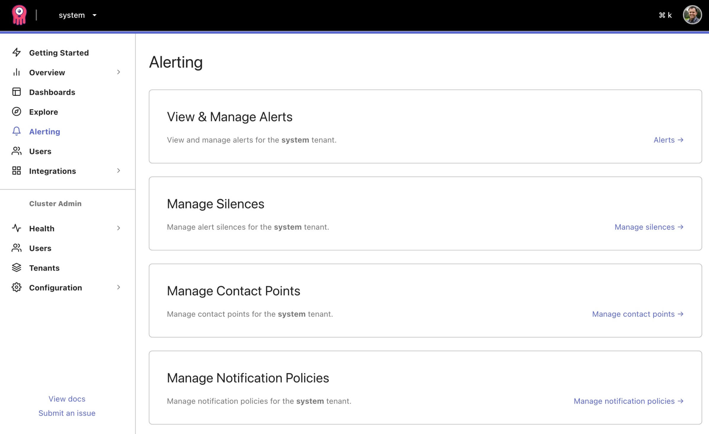

# Configuring Alertmanager

Opstrace supports configuring Alertmanager rules and alert outputs on a per-tenant basis.
For example, you might have an alerting rule that metric `X` must be less than 5, and an Alertmanager configuration to send a Slack message when the rule is failing.
This can all be visualized and edited with the unified alerting in Grafana 8.

If you haven't used Prometheus Alertmanager before, we recommend checking out [https://prometheus.io/docs/alerting/latest/alertmanager](https://prometheus.io/docs/alerting/latest/alertmanager).
Opstrace uses [Cortex](https://cortexmetrics.io) which adds support for scaling and multiple tenants on top of Prometheus.

To learn more about the configuration content itself, look at the Prometheus documentation for [Recording Rules](https://prometheus.io/docs/prometheus/latest/configuration/recording_rules), [Alerting Rules](https://prometheus.io/docs/prometheus/latest/configuration/alerting_rules), and [Alertmanager](https://www.prometheus.io/docs/alerting/latest/alertmanager) documentation.

You can configure the Alertmanager for each tenant from within the Grafana 8 interface.
To do this, in the sidebar, click "Alerting" under the tenant you want to configure.
You'll be presented with the configuration page:

TODO

## Configure an Alert Rule

TODO

## Configure a Contact Point

TODO

## Configure a Notification Policy

TODO

## Silencing an Alert

TODO

## References

* [Prometheus Alertmanager](https://www.prometheus.io/docs/alerting/latest/alertmanager)
* [Cortex Scalable Alertmanager](https://cortexmetrics.io/docs/proposals/scalable-alertmanager)
* [Alertmanager Configuration](https://www.prometheus.io/docs/alerting/latest/configuration)
* [Recording rules](https://prometheus.io/docs/prometheus/latest/configuration/recording_rules)
* [Alerting rules](https://prometheus.io/docs/prometheus/latest/configuration/alerting_rules)
